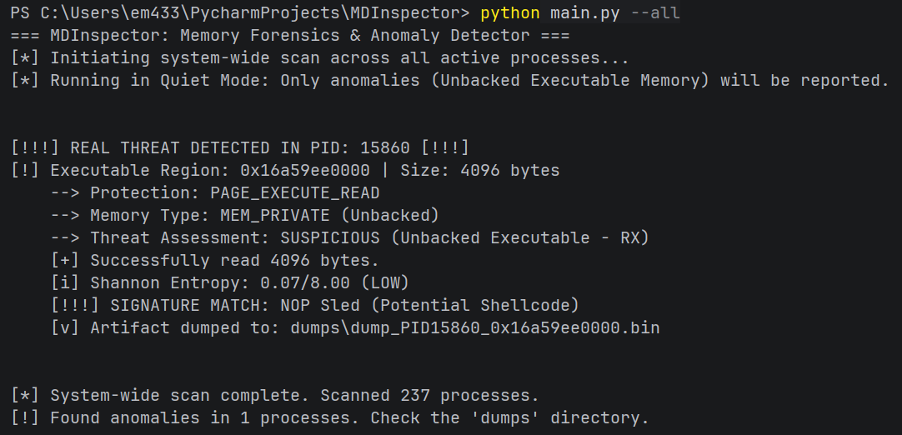
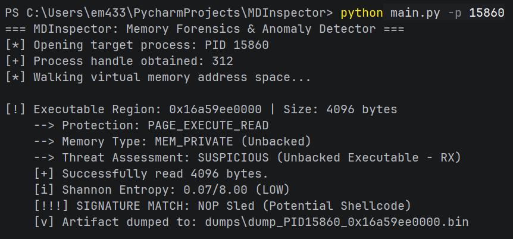

הבלוקים הפנימיים של ה-`cmd` סגרו את ה-Markdown החיצוני בגלל ששניהם השתמשו ב-3 גרשים. עטפתי את הכל בבלוק של 4 גרשים כדי ששום דבר לא יברח:

```markdown
# MDInspector (Memory Dump & Anomaly Inspector) 🔍

MDInspector is a specialized Windows memory forensics and triage tool written in Python. It interacts directly with the Windows API via `ctypes` to identify, analyze, and dump evasive memory-resident threats—such as Fileless Malware, Shellcode, and Reflective DLL Injections—in live virtual memory spaces.

---

## 🧠 Core Architecture & Detection Logic

Traditional endpoint security solutions and AV scanners frequently focus on disk-based file signatures. In contrast, modern malware operates filelessly in RAM, often evading basic memory monitors that look only for `PAGE_EXECUTE_READWRITE` (RWX) allocations by leveraging **W^X bypasses** (allocating as `RW`, writing shellcode, then flipping protection to `RX`).

MDInspector analyzes the internal memory structures of Windows to identify anomalies at the virtual page level:

* **Executable Unbacked Memory:** Uses `VirtualQueryEx` to walk the virtual address space, flagging any region with executable permissions (`PAGE_EXECUTE`, `PAGE_EXECUTE_READ`, `PAGE_EXECUTE_READWRITE`) that resides in `MEM_PRIVATE` memory rather than a file-backed image (`MEM_IMAGE`).
* **W^X Bypass Mitigation:** Detects unbacked pages even if permissions have been flipped strictly to `PAGE_EXECUTE_READ` (RX), closing a common evasion blindspot.
* **Smart Dump Engine & JIT Noise Suppression:** Legitimate runtimes (browsers, Electron apps, .NET) constantly allocate unbacked executable memory for Just-In-Time (JIT) compilation. MDInspector calculates the **Shannon Entropy** of each region:
  * *Low Entropy (< 3.0) & No Signatures:* Classified as legitimate JIT compilation. Suppresses disk dumps during automated runs to prevent alert fatigue and storage saturation.
  * *High Entropy (> 6.5) or Signature Match:* Classified as packed, encrypted, or staged payloads and immediately dumped to disk.
* **Targeted Signature Matching:** Inspects extracted buffers for injection artifacts, including injected PE headers (`MZ`), NOP Sleds (`\x90` sequences), and shellcode patterns.

---

## ⚙️ Key Features

* **Automated System-Wide Triage (`--all`):** Rapidly walks all active processes on the host via `EnumProcesses` in **Quiet Mode**, surfacing only actionable anomalies while discarding background noise.
* **Targeted Deep Dive (`-p <PID>`):** Scans a specific process with full visibility, outputting details on all unbacked regions (including identified JIT pages) for incident responders.
* **Shannon Entropy Analysis:** Heuristic evaluation to detect packed, compressed, or encrypted payloads.
* **Safe Forensic Extraction:** Dumps malicious memory artifacts to `dumps/dump_PID<pid>_<address>.bin` using `ReadProcessMemory`, protected with an upper safety buffer limit (50MB) to prevent memory exhaustion.

---

## 🚀 Usage

### Prerequisites
* Windows OS
* Python 3.x
* Elevated / Administrative terminal (required to acquire `PROCESS_QUERY_INFORMATION | PROCESS_VM_READ` handles to protected processes).

---

### 1. System-Wide Triage (Quiet Mode)
Scans every running process across the system. Suppresses legitimate JIT regions and reports only high-confidence threats:

```cmd
python main.py --all
```



---

### 2. Targeted Process Inspection
Analyzes a specific Process ID (PID) with full diagnostic output:

```cmd
python main.py -p <PID>
```



---

## 🧪 Testing in the Lab (Mock Payload Injection)

A dedicated script (`dummy_injector.py`) is included to validate the detection engine against both classic and evasive injection patterns without executing malicious payloads.

1. Launch the injector in a terminal:
   ```cmd
   python dummy_injector.py
   ```
2. Select your injection scenario:
   * **Option 1 (Classic RWX):** Allocates direct `PAGE_EXECUTE_READWRITE` memory.
   * **Option 2 (Modern W^X Bypass):** Allocates `PAGE_READWRITE`, writes the mock shellcode, and transitions protection to `PAGE_EXECUTE_READ` via `VirtualProtect`.
3. Note the displayed PID and leave the process running.
4. Execute MDInspector against the target PID or run a system-wide scan:
   ```cmd
   python main.py -p <PID>
   ```
5. Inspect the generated payload dump in the `dumps/` directory.

---

## ⚠️ Disclaimer

This project was developed for defensive research, digital forensics, and academic study of Windows Internals. Always ensure proper authorization before analyzing live target processes in production environments.

```